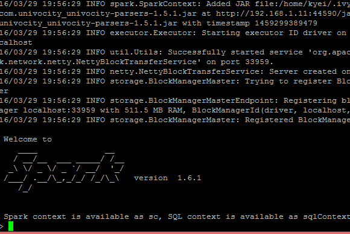
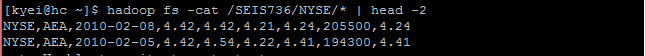

## Apache SparkR ##
Lawrence Kyei & Brad Rubin  
4/01/2016

R is a language and environment that allows data scientist to be able to perform statistical computing and visualization on a dataset. R provides a wide variety of statistical techniques like linear and nonlinear modelling, time-series analysis, clustering, etc. and is highly extensible. However using R is limited to datasets on a single machine. Apache SparkR enables provides a distributed dataframe implementation that supports operations like selection, filtering, aggregation etc. (similar to R data frames with dplyr) on large datasets.

In this How-To, we  demonstrate how to use SparkR to solve a computation of the maximum daily change for each stock symbol, and output it in sorted stock symbol order, in a single file on the cluster.

First let's start by setting up our environment.
 
- We will have to download Apache Spark from [here](http://spark.apache.org/downloads.html) This should look like this

- From item 4 in the figure screenshot,  click to download Apache Spark
- Copy **spark-1.0.6-bin-hadoop2.6-tgz** to the cluster and unpackage it there
- Download spark-csv_2.10:1.4.0 from [here](http://spark-packages.org/package/databricks/spark-csv) and place it in the directory where you unpackaged spark

The .tgz file can be copied to the cluster using WinSCP. After copying .tgz file to the cluster, we can unpackage it with the command

    tar -xvzf spark-1.6.1-bin-hadoop2.6.tgz

To get SparkR running and accessing HDFS, in the root directory we will run the following commands in the shell to export the necessary libraries and configurations.

    $ export JAVA_HOME=/usr/java/jdk1.7.0_67-cloudera
    $ export HADOOP_CONF_DIR=/etc/hadoop/conf
    $ spark-1.6.1-bin-hadoop2.6/bin/sparkR --packages com.databricks:spark-csv_2.10:1.4.0

If everything is successful, here is how it looks.

Next we will have to take a look at our source data. Open another instance of PuTTY or ssh and enter the following command to view a sample of our dataset.

    
Once we have an idea of what our data looks like, we can go ahead and solve our problem by entering these commands in the SparkR shell:

    # First, we read in our external datasets from HDFS by creating a dataFrame using CSV format
    input <- read.df(sqlContext, "/SEIS736/NYSE","com.databricks.spark.csv")

    # Compute the stock percentage gain
    stkYield <- selectExpr(input, "C1 as Stk", "(C4 - C5) * 100 / (C5 + 0.001) as Yield")

    # Group and sort by stock symbol, finding the maxiumum yield
    result <- arrange(summarize(groupBy(stkYield, stkYield$Stk), max(stkYield$Yield)),stkYield$Stk)

    # Collapse the result into a single partition so we get a single output file
    resultSingle <- repartition(result, 1L)

    # Write the content of the dataFrame to an HDFS directory called test in CSV format
    write.df(resultSingle, "test","com.databricks.spark.csv","overwrite”)

### Results ###
To get the results we run the command **head resultSingle** to see the first few lines of output. 

    $ head resultSingle 

       Stk max(Yield)
    1 <NA>         NA
    2   AA   40.82233
    3  AAI   88.82867
    4  AAN   36.31980
    5  AAP   34.19999
    6  AAR   99.96668
