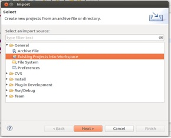
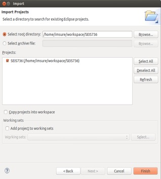
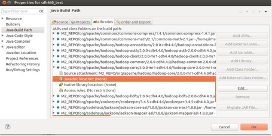
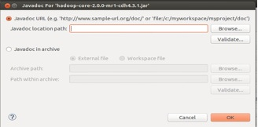

# Setup Eclipse for Hadoop Development Using Maven

For Ubuntu and Mac Users

Shuo Yang 9/17/2013

### Using the software lifecycle and build tool Maven, you can configure Eclipse for Hadoop development in minutes.
---
*Note: This document assumes a package name of edu.stthomas.gps and a project name of SEIS736, so change these to meet your requirements*

### Install Maven

First, open a shell terminal and check if Maven version 3 is already installed. 

`
$ mvn -v
`


*Note for Mac Users: If you install XCode, Maven 3 should be installed for you*


If it is not installed, enter the following command to install (make sure you have access to the Internet)

`
$ sudo apt-get install maven
`

After it is completely done, type in 'mvn -v' again, you might see the following information

	Apache Maven 3.0.4 
	Maven home: /usr/share/maven 
	Java version: 1.6.0_27, vendor: Sun Microsystems Inc. 
	Java home: /usr/lib/jvm/java-6-openjdk-amd64/jre 
	Default locale: en_US, platform encoding: UTF-8 
	OS name: "linux", version: "3.8.0-30-generic", arch: "amd64", family: "unix" 

### Install Eclipse

To install Eclipse, enter the following command (make sure you have access to the Internet)


`
$ sudo apt-get install eclipse
`

### Integrate Maven with Eclipse

Change your working directory to Eclipse's workspace. Assume it is under you home directory.

`
$ cd ~/workspace
`


Enter the following command

	$ mvn archetype:generate -DgroupId=edu.stthomas.gps -DartifactId=SEIS736 \
	-DarchetypeArtifactId=maven-archetype-quickstart -DinteractiveMode=false

*Note: The backslash at the end of the first line means the command is not complete. We often use it for a long command, so if you want to enter the command on two lines, use it. But if you type the command on one line, you should not type backslash.*

After it is done, there will be a directory called SEIS736 created under the current directory. Go into this directory

`
$ cd SEIS736
`


Enter the following command (make sure you have access to the Internet):

	$ mvn -Declipse.workspace=/home/username/workspace \
	eclipse:configure-workspace eclipse:eclipse


*Note: remember to replace 'username' with your real user name*

Replace the pom.xml file (under the directory SEIS736) with this one

[pom.xml](https://github.com/CoE4BD/HadoopHowTo/blob/master/hadoopmaven/pom.xml)


`
$ mvn eclipse:clean eclipse:eclipse
`

### Set up M2_REPO environment variable

Go to your home directory

`
$ cd ~
`


Open .bashrc file with a text editor, and add the following line to the end of the file, then save and quit.

`
export M2_REPO=$HOME/.m2/repository
`

Enter the following command

`
$ source .bashrc
`

### Import project into Eclipse

Start eclipse, and select 
File->Import->Existing Projects Into Workspace


Choose SEIS736 and import it into Eclipse


You can now add source file to SEIS736->src/main/java->edu.stthomas.edu and all the Hadoop references should resolve. 

### Add javadoc for Hadoop
*Note: This manual step is currently necessary because Cloudera is missing the Javadoc JAR for hadoop-core.*

Go to File->Properties, select M2_REPO/org/apache/hadoop/hadoop-core/2.0.0-mr1-cdh4.4.0/hadoop-core-2.0.0-mr1-cdh4.4.0.jar



Double click Javadoc location


Enter http://archive.cloudera.com/cdh4/cdh/4/hadoop/api/ into Javadoc location path, then click OK.

### Compile the project

Under your project directory SEIS736, enter the following command

`
$ mvn package
`


Then in Eclipse, right click SEIS736 and select Refresh. Then you will see a jar file called  SEIS736-1.0.jar generated under target directory.

### Upload jar file to the server

Under SEIS736, create a shell script called upload.sh with the following two lines of code

	#!/bin/sh
	scp -r ~/workspace/SEIS736/target/SEIS736-1.0.jar \
	username@hc.gps.stthomas.edu:/home/username/

Then enter the following command

`
$ mvn install
`

