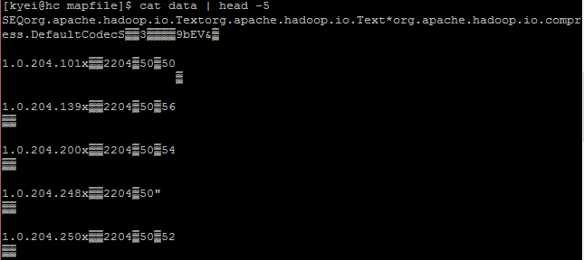

# Hadoop MapFile

Scott Jilek & Lawrence Kyei  
4/12/2016

A MapFile is a sorted SequenceFile with an index to permit lookups by key. It is available read-only to all map and reduce tasks. Unlike the Distributed Cache facility, which is restricted in size to available heap, MapFiles reside on disk, so they can scale to larger sizes. The standard SequenceFile format allows developers to append key-value pairs, but does not allow developers to modify or remove inserted values in HDFS. This makes looking up specific keys costly because we have to read the whole file until we find our key. A solution to this problem is a MapFile, which gives us random access, read/write capability.

### Sample Data
Our sample data is a compressed CollecTor exit node list data that I collected from a Tor website. The decompressed exit node list is approximately 8.5 GB of data, spread across thousands of small files, each of which is around 200kb. Processing this in HDFS as-is is not feasible. This data was pre-processed in order to make it easily consumable in a MapReduce program. The reducer output of our MapReduce produced a single file with the key being an IP address, and value being a list of dates that IP was known to be a Tor exit node.

### Creating a MapFile
Due to the size of the data, I needed an efficient way to access that data from all mappers running concurrently. Creating a MapFile was the solution because i was able to perform lookups against the data.
The program to create the MapFile needs several things:
 
- A key/value pair file to index 
- The data types of the key/value pairs
- An output directory where the MapFile should be created
- And an index interval for creating the index file

**CreateMapFile.java**

    package stubs;
    import java.io.BufferedReader;
    import java.io.IOException;
    import java.io.InputStreamReader;
    import org.apache.hadoop.fs.FileSystem;
    import org.apache.hadoop.fs.Path;
    import org.apache.hadoop.conf.Configuration;
    import org.apache.hadoop.conf.Configured;
    import org.apache.hadoop.io.MapFile;
    import org.apache.hadoop.io.SequenceFile;
    import org.apache.hadoop.io.Text;
    import org.apache.hadoop.io.MapFile.Writer.Option;

    public class CreateMapFile extends Configured {

    static Text mapFileOutputKey = new Text();
    static Text mapFileOutputValue = new Text();
    public static void main(String[] args) throws Exception
     {
      /*
       * Validate that two arguments were passed from the command line.
       */
      if (args.length != 1) {
      System.out.printf("Usage: CreateMapFile <input dir>\n" );
      System.exit(-1);
     }
    Configuration conf = new Configuration();
    //CreateMapFile output = new CreateMapFile();
    CreateMapFileFunction (conf, "hdfs:///user/srjilek/" + args[0] + "/part-r-00000",
    "hdfs:///user/srjilek/" + args[0] + "/", 0, 1);
    }

    /*
     * Function creates my mapfile from the tor data reducer output
     * adapted from original code found here:
     * http://www.codeproject.com/Articles/887028/Implementing-Joins-in-Hadoop-Map-Reduce-* using-MapF
     * and HDFS file reading adapted from here:
     * https://sites.google.com/site/hadoopandhive/home/hadoop-how-to-read-a-file-from-  hdfs
    */

    private static void CreateMapFileFunction (Configuration conf,
											   String inputFile,
											   String,
    										   outputFilePath,
                                               int keyIndex,
                                               int valueIndex) throws IOException
    {
    Path outputLocation = new Path(outputFilePath);
    //Option keyClass = (Option)MapFile.Writer.keyClass(IntWritable.class);
	    Option keyClass = (Option)MapFile.Writer.keyClass(Text.class);
	    SequenceFile.Writer.Option valueClass = MapFile.Writer.valueClass(Text.class);
	    
	    MapFile.Writer.setIndexInterval(conf, 100);
	    
	    MapFile.Writer writer = new MapFile.Writer(conf,
												   outputLocation,
												   keyClass,
												   valueClass);

	    //////*********************
	    FileSystem fs = FileSystem.get(conf);
	    Path inputFilePath = new Path(inputFile);
	    
	    BufferedReader br=new BufferedReader(new InputStreamReader(fs.open(inputFilePath)));
        String line=br.readLine();

        while (line != null){
            //System.out.println(line);
 
    	    String[] lineItems = line.split("\\t");
	        //IntWritable key = new IntWritable(Integer.parseInt(lineItems[keyIndex]));
	        mapFileOutputKey.set(lineItems[keyIndex]);
	        
	        //Text value = new Text(lineItems[valueIndex]);
	        mapFileOutputValue.set(lineItems[valueIndex]);
	        writer.append(mapFileOutputKey, mapFileOutputValue);            

            line=br.readLine();
        }
	    
	    br.close();
	    writer.close();
	}		
	
	
    /*
     * Returns the long format of the provided IP address.
     * @param ipAddress the IP address
     * @return the long format of <code>ipAddress</code>
     * @throws IllegalArgumentException if <code>ipAddress</code> is invalid
     * Code from: http://hawkee.com/snippet/9731/
     */
    public static long IPStringToLong(String ipAddress) {
        if (ipAddress == null || ipAddress.isEmpty()) {
            throw new IllegalArgumentException("ip address cannot be null or empty");
        }
        String[] octets = ipAddress.split(java.util.regex.Pattern.quote("."));
        if (octets.length != 4) {
            throw new IllegalArgumentException("invalid ip address");
        }
        long ip = 0;
        for (int i = 3; i >= 0; i--) {
            long octet = Long.parseLong(octets[3 - i]);
            if (octet > 255 || octet < 0) {
                throw new IllegalArgumentException("invalid ip address");
            }
            ip |= octet << (i * 8);
        }
        return ip;
    }

    /**
     * Returns the 32bit dotted format of the provided long ip
     * @param ip the long ip
     * @return the 32bit dotted format of <code>ip</code>
     * @throws IllegalArgumentException if <code>ip</code> is invalid
     * Code from: http://hawkee.com/snippet/9731/
     */

    public static String LongtoIPString(long ip) {
        // if ip is bigger than 255.255.255.255 or smaller than 0.0.0.0
        if (ip > 4294967295l || ip < 0) {
            throw new IllegalArgumentException("invalid ip");
        }
        StringBuilder ipAddress = new StringBuilder();
        for (int i = 3; i >= 0; i--) {
            int shift = i * 8;
            ipAddress.append((ip & (0xff << shift)) >> shift);
            if (i > 0) {
                ipAddress.append(".");
            }
        }
        return ipAddress.toString();
     }
    
    }

### Running the Code
After creating the JAR from our code, we execute the following command.

    hadoop jar uber.jar stubs.CreateMapFile tor/mapfile

### Output
After running the CreateMapfile file, this produces the data files and index. Here is how the data files look.

**Data files**

**Index**

