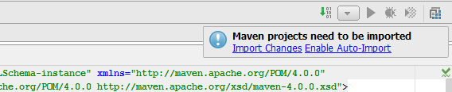

## Scala WordCount - How to configure Scala/Spark development using IntelliJ and Maven on Windows##

Lawrence Kyei
2/09/2016

This tutorial provides a quick and easy steps on how to create your first project using IntelliJ IDEA and Maven. Below are the tools and technologies we will need to create out our first project.

###1. Prerequisites
- **JDK 1.7** - Download [Here](http://www.oracle.com/technetwork/java/javase/downloads/jdk7-downloads-1880260.html)
- **Scala 2.10.5** - Download [Here](http://www.scala-lang.org/download/2.10.5.html)
- **Latest Version of Maven** - Download [Here](http://maven.apache.org/download.cgi)(Please note Maven 3.3 requires JDK 1.7 or above to execute)
- **SBT** - Download [Here](http://www.scala-sbt.org/download.html)

Next Step is configuring **ALL FOUR** in the system variables after installation or unzipping is done. Before configuration, your directory PATH on your local drive C:\ should look like this.

- JAVA_HOME -->  C:\Program Files\Java\jdk1.8.0_71
- MAVEN_HOME --> C:\Program Files\Dev\apache-maven-3.3.3
- SCALA_HOME --> C:\Program Files (x86)\scala
- SBT_HOME --> C:\Program Files (x86)\sbt\

Here is how you get to Systems Variable in Windows;
**Control Panel****-->****System and Security****-->****System****-->****Advanced System settings**

In the Environment Variables window, look for PATH under System variables, highlight, click edit and append the Path lines with the paths you want the computer to access. Each different directory is separated with a semicolon as shown below. In our case it should be;

**%JAVA_HOME%\bin; %MAVEN_HOME%\bin;%SCALA_HOME%\bin;%SBT_HOME%\bin;**

It is important to note that the Path should include bin. 

###2. Download and Install IntelliJ 
- Download IntelliJ [here](http://www.jetbrains.com/idea/download/#section=windows) and install.
- Download scala plugin 
**File-->Settings-->Plugins-->Install JetBrains plugin...** and type **scala** in the search space and click install.

Configure Maven settings if your are using proxy. Copy settings.xml file from %MAVEN_HOME%\conf\settings.xml and paste it to C:\Users\lawrence\ .m2. Enable proxy by uncommenting xml code and putting in your proxy details

###3. Create Project
**1)File-->New-->Project, choose Scala**, click Next and type in the Project name

There are a couple of things to check before you click finish.
- Click New next to Project SDK, choose JDK and navigate to folder jdk under java on your local drive C, load the folder and click OK. 
- Click create to Scala SDK, it will display the installed Scala, check the box and click OK.
This should look like this;

- Click finish, a dialog box pop up. Choose "New Window".

**2)Add Maven Support**

- Right click on the Project name and choose "Add Framework Support...", scroll down and check "Maven".
- Double click on the pom.xml, delete the content, copy and paste the sample.xml below and check for the text in red for errors.

**Sample.xml**

    <project xmlns:xsi="http://www.w3.org/2001/XMLSchema-instance" xmlns="http://maven.apache.org/POM/4.0.0"
         xsi:schemaLocation="http://maven.apache.org/POM/4.0.0 http://maven.apache.org/xsd/maven-4.0.0.xsd">
    <modelVersion>4.0.0</modelVersion>
    <groupId>com.bradrubin</groupId>
    <artifactId>Spark</artifactId>
    <version>0.0.1-SNAPSHOT</version>
    <packaging>jar</packaging>
    <properties>
        <project.build.sourceEncoding>UTF-8</project.build.sourceEncoding>
        <scala.version>2.10.5</scala.version>
        <scala.binary.version>2.10</scala.binary.version>
        <scala.version.tools>2.10</scala.version.tools>
        <spark.version>1.5.0-cdh5.5.1</spark.version>
    </properties>

    <build>
        <sourceDirectory>src/main/scala</sourceDirectory>
        <testSourceDirectory>src/test/scala</testSourceDirectory>
        <plugins>
            <plugin>
                <artifactId>maven-compiler-plugin</artifactId>
                <version>3.3</version>
                <configuration>
                    <source>1.7</source>
                    <target>1.7</target>
                </configuration>
            </plugin>
            <plugin>
                <groupId>org.apache.maven.plugins</groupId>
                <artifactId>maven-shade-plugin</artifactId>
                <version>2.4.2</version>
                <executions>
                    <execution>
                        <phase>package</phase>
                        <goals>
                            <goal>shade</goal>
                        </goals>
                    </execution>
                </executions>
                <configuration>
                    <filters>
                        <filter>
                            <artifact>*:*</artifact>
                            <excludes>
                                <exclude>META-INF/*.SF</exclude>
                                <exclude>META-INF/*.DSA</exclude>
                                <exclude>META-INF/*.RSA</exclude>
                            </excludes>
                        </filter>
                    </filters>
                    <!--<finalName>uber-${project.artifactId}-${project.version}</finalName>-->
                </configuration>
            </plugin>

            <plugin>
                <groupId>org.apache.maven.plugins</groupId>
                <artifactId>maven-jar-plugin</artifactId>
                <version>2.6</version>
                <configuration>
                    <excludes>
                        <exclude>**/spark-core/*</exclude>
                    </excludes>
                </configuration>
            </plugin>

            <plugin>
                <groupId>net.alchim31.maven</groupId>
                <artifactId>scala-maven-plugin</artifactId>
                <version>3.2.0</version>
                <executions>
                    <execution>
                        <!-- this is so we don't end with a compile error in maven-compiler-plugin -->
                        <phase>process-sources</phase>
                        <goals>
                            <goal>add-source</goal>
                            <goal>compile</goal>
                            <goal>testCompile</goal>
                        </goals>
                        <configuration>
                            <scalaCompatVersion>${scala.binary.version}</scalaCompatVersion>
                            <scalaVersion>${scala.version}</scalaVersion>
                            <args>
                                <arg>-feature</arg>
                                <arg>-deprecation</arg>
                            </args>
                        </configuration>
                    </execution>
                </executions>
            </plugin>

            <plugin>
                <groupId>org.apache.maven.plugins</groupId>
                <artifactId>maven-surefire-plugin</artifactId>
                <version>2.7</version>
                <configuration>
                    <skipTests>true</skipTests>
                </configuration>
            </plugin>

            <plugin>
                <groupId>org.codehaus.mojo</groupId>
                <artifactId>exec-maven-plugin</artifactId>
                <version>1.2.1</version>
                <executions>
                    <execution>
                        <id>upload</id>
                        <phase>install</phase>
                        <goals>
                            <goal>exec</goal>
                        </goals>
                        <configuration>
                            <executable>${project.basedir}/src/main/resources/upload.sh</executable>
                        </configuration>
                    </execution>
                </executions>
            </plugin>

            <plugin>
                <groupId>org.scalatest</groupId>
                <artifactId>scalatest-maven-plugin</artifactId>
                <version>1.0</version>
                <configuration>
                    <skipTests>false</skipTests>
                    <reportsDirectory>${project.build.directory}/surefire-reports</reportsDirectory>
                    <junitxml>.</junitxml>
                    <filereports>TestSuite.txt</filereports>
                </configuration>
                <executions>
                    <execution>
                        <id>test</id>
                        <goals>
                            <goal>test</goal>
                        </goals>
                    </execution>
                </executions>
            </plugin>
        </plugins>
    </build>

    <repositories>
        <repository>
            <id>cloudera</id>
            <url>https://repository.cloudera.com/artifactory/cloudera-repos</url>
            <releases>
                <enabled>true</enabled>
            </releases>
            <snapshots>
                <enabled>false</enabled>
            </snapshots>
        </repository>

        <repository>
            <id>scala-tools.org</id>
            <name>Scala-tools Maven2 Repository</name>
            <url>http://scala-tools.org/repo-releases</url>
        </repository>
    </repositories>

    <dependencies>
        <dependency>
            <groupId>org.apache.spark</groupId>
            <artifactId>spark-core_2.10</artifactId>
            <version>${spark.version}</version>
            <exclusions>
                <exclusion>
                    <groupId>org.xerial.snappy</groupId>
                    <artifactId>snappy-java</artifactId>
                </exclusion>
            </exclusions>
            <scope>provided</scope>
        </dependency>

        <dependency>
            <groupId>org.apache.spark</groupId>
            <artifactId>spark-streaming_2.10</artifactId>
            <version>1.3.0</version>
            <scope>provided</scope>
        </dependency>

        <dependency>
            <groupId>org.apache.spark</groupId>
            <artifactId>spark-sql_2.10</artifactId>
            <version>1.3.0</version>
            <scope>provided</scope>
        </dependency>

        <dependency>
            <groupId>org.xerial.snappy</groupId>
            <artifactId>snappy-java</artifactId>
            <version>1.0.5</version>
        </dependency>

        <dependency>
            <groupId>org.scala-lang</groupId>
            <artifactId>scala-library</artifactId>
            <version>${scala.version}</version>
            <scope>provided</scope>
        </dependency>

        <dependency>
            <groupId>com.databricks</groupId>
            <artifactId>spark-csv_2.10</artifactId>
            <version>1.3.0</version>
        </dependency>

        <dependency>
            <groupId>org.scalatest</groupId>
            <artifactId>scalatest_${scala.version.tools}</artifactId>
            <version>2.2.1</version>
            <scope>test</scope>
        </dependency>
    </dependencies>
    </project>

**Fixing Xml errors in IntelliJ**

- Right click on main dir under src dir, New, choose package and give the project the name scala
- Do same under the test dir and name it scala as well.

After fixing the errors, on the top right corner, a dialog box pops up. Please choose Enable Auto-Import and maven will start downloading specified dependencies.

- Then add this new dir "scala" to the project source
**File-->Project Structure-->Modules-->scala-->Source** 

###4) Create Scala Object
Right click on the scala folder, new Scala class, choose object from the drop down and give your object a name.

Now write your code, below is the code for ScalaWordCount.scala

**ScalaWordCount.scala**

    package com.bradrubin.spark;

    /**
    * User: Scala/Spark
    * Date: 02/08/2016
    */

    import org.apache.spark.SparkConf
    import org.apache.spark.SparkContext
    import org.apache.spark.SparkContext._

    object ScalaWordCount {
      def main(args: Array[String]) {
        if (args.length < 1) {
          System.err.println("Usage: <file>")
          System.exit(1)
    }

        val conf = new SparkConf()
        val sc = new SparkContext(conf)
        val numOutputFiles = args(3).toInt

        val line = sc.textFile(args(0))

        line.flatMap(_.split(" ")).map((_, 1)).reduceByKey(_+_, numOutputFiles).saveAsTextFile(args(2))
        sc.stop()
      }
    }

###5) Create Spark Jar with Maven
Go to **File-->Project Structure-->Artifacts**, click on the plus sign, **Add JAR-->From modules with dependencies**. A pop window appears that requires you select the Main class

This creates a MANIFEST.MF file under META-INF folder. This file shows you the name of the main class.

Now open the command line and change the dir to the project dir where you have the pom.xml file.

Enter the command
> mvn package

Two Spark jars are created under the target folder, the one called **"original-Spark-0.0.1-SNAPSHOT.jar"** does include dependencies. The actual Spark jar is **"Spark-0.0.1-SNAPSHOT.jar"** and that is what will be shipped and ran on the cluster.