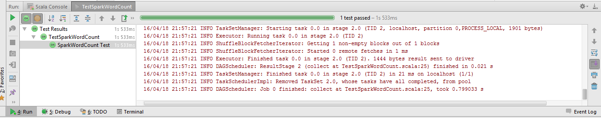

# Spark Unit Test

Lawrence Kyei & Brad Rubin  
4/19/2014

### Here is how to unit test Scala Spark code using Scalatest
---
In this tutorial we will illustrate how to write a unit test for a Spark application using the classic Scala WordCount example with the Scalatest framework. Writing unit tests in Spark is fairly simple if we adopt the strategy of restructuring our code to separate out the three main phases:

- input
- processing
- output

We will then use Scalatest in IntelliJ IDEA. This gives an MRUnit-like experience. Below is the WordCount code and its associated unit test code.

**SparkWordCount.scala**

    package edu.stthomas.gps.spark

    import org.apache.spark.rdd.RDD
    import org.apache.spark.rdd.RDD.{rddToOrderedRDDFunctions, rddToPairRDDFunctions}
    import org.apache.spark.{SparkConf, SparkContext}

    object SparkWordCount {

      var sc: SparkContext = _

      def setSC(s: SparkContext): Unit = sc = s
      
      def main(args: Array[String]) {

        if (args.length < 3) {
          println("Usage: SparkWordCount <input> <output> <numOutputFiles>")
          System.exit(1)
        }

        val inputArg0: (Unit => RDD[String]) = Unit => input(args(0))
        val processArg2: (RDD[String] => RDD[(String, Int)]) = process(_, args(2).toInt)
        val outputArg1: (RDD[(String, Int)] => Unit) = output(_, args(1))

        (inputArg0 andThen processArg2 andThen outputArg1) ()

        System.exit(0)
      }

      def input(inputFileName: String): RDD[String] = {
        val sparkConf = new SparkConf().setAppName("Spark WordCount")
        setSC(new SparkContext(sparkConf))
        sc.textFile(inputFileName)
      }

      def process(rddIn: RDD[String], numTasks: Int): RDD[(String, Int)] = rddIn
        .flatMap(line => line.split("\\W+"))
        .map(word => (word.toLowerCase, 1))
        .reduceByKey(_ + _, numPartitions = numTasks)
        .sortByKey(ascending = true)

      def output(rdd: RDD[(String, Int)], outputFileName: String): Unit = rdd.saveAsTextFile(outputFileName)
    }

**TestSparkWordCount.scala**

    package edu.stthomas.gps.spark

    import org.apache.spark.rdd.RDD
    import org.apache.spark.{SparkConf, SparkContext}
    import org.scalatest.{BeforeAndAfter, FunSuite}

    class TestSparkWordCount extends FunSuite with BeforeAndAfter {

      var sc: SparkContext = _

      before {
        val conf = new SparkConf()
          .setAppName("Test SparkWordCount")
          .setMaster("local")
          .set("spark.default.parallelism", "1")

        sc = new SparkContext(conf)
      }

      test("SparkWordCount Test") {

        val in: RDD[String] = sc.parallelize(Seq("The quick brown fox jumps over the lazy brown dog."))
        val out: Array[(String, Int)] = Array(("brown", 2), ("dog", 1), ("fox", 1), ("jumps", 1), ("lazy", 1), ("over", 1), ("quick", 1), ("the", 2))
        SparkWordCount.setSC(sc)
        assertResult(out)(SparkWordCount.process(in, 1).collect)
      }

      after {
        sc.stop()
      }
    }

**Results**
